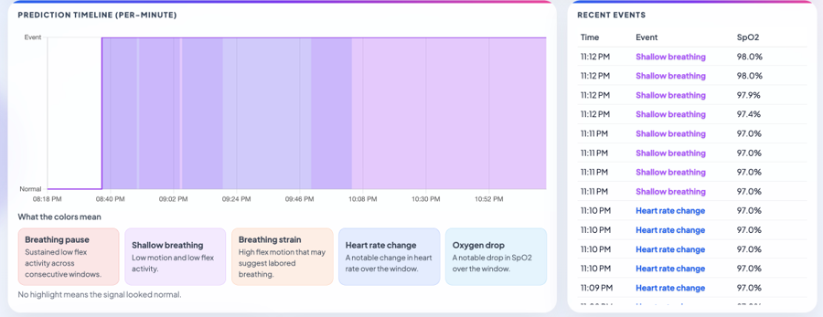
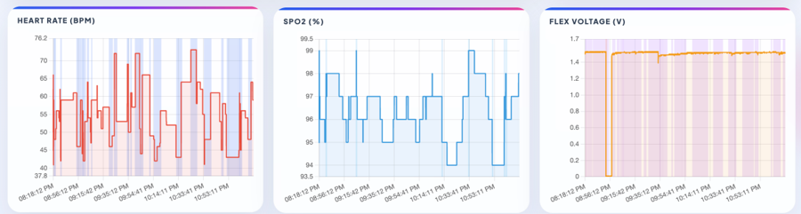

- Slumber — Simple Sleep Screening

<!-- Dashboard images -->



Overview
- Purpose: lightweight pipeline to collect wearable vitals (HR, SpO2, flex), store them in MySQL, run a per-minute ML inference for possible sleep-apnea events, and visualise results in a browser dashboard.
- Components:
  - `Inferencing_Code/`: Python code for training, running inference, visualisation and serial bridge.
  - `php_files/`: PHP endpoints used by the frontend to read/write vitals and to trigger inference.
  - `public/`: Static dashboard (`dashboard.html`) that uses Chart.js to visualise data and inference output.

Technologies
- Python 3.9+ (project expects 3.9)
- Python packages: joblib, matplotlib, numpy, pandas, scikit-learn, wfdb, pyserial, mysql-connector-python
  (core deps listed in `Inferencing_Code/pyproject.toml`)
- MySQL (database `db_health`, table `tbl_vitals`)
- PHP (simple API wrappers in `php_files/`)
- Chart.js for frontend visualisation
- ESP32 (or other serial device) supported via `serial_comms.py` (reads JSON lines from serial)

Quick setup (Windows)
1. Install system prerequisites
   - Install Python 3.9+ and add to PATH
   - Install MySQL server and create a database user
   - Install PHP + a web server (or use PHP built-in server for testing)

2. Python virtual environment
   Open PowerShell or bash in `Inferencing_Code/` and run:

```
python -m venv .venv
# PowerShell
.\.venv\Scripts\Activate.ps1
# or bash
source .venv/bin/activate
pip install --upgrade pip
pip install joblib matplotlib numpy pandas scikit-learn wfdb pyserial mysql-connector-python
```

(Note: `Inferencing_Code/pyproject.toml` lists the main scientific deps; additional runtime libs used here are `pyserial` and `mysql-connector-python`.)

3. Database schema
- Create the database and table used by the project. Example SQL:

```
CREATE DATABASE IF NOT EXISTS db_health;
USE db_health;

CREATE TABLE IF NOT EXISTS tbl_vitals (
  id INT AUTO_INCREMENT PRIMARY KEY,
  hr INT NOT NULL,
  spo2 INT NOT NULL,
  flex_voltage FLOAT DEFAULT 0,
  created_at DATETIME DEFAULT CURRENT_TIMESTAMP
);
```

4. Configure PHP endpoints
- Put `php_files/` into your PHP web root (or point your server to the repository folder).
- Edit `php_files/get_inference.php` and update the `$python` variable to point to the Python executable inside your virtualenv (for example `C:\...\Inferencing_Code\.venv\Scripts\python.exe`).

5. Serial bridge (ESP32 -> MySQL)
- Edit `Inferencing_Code/serial_comms.py` to set `SERIAL_PORT` and `DB_CONFIG` to match your environment.
- Activate the Python venv and run:

```
python serial_comms.py
```

The script expects JSON lines from the device like: {"hr": 72, "spo2": 97, "flex": 0.12}

6. Run inference directly (CLI)
- Use the provided CLI wrapper which returns JSON. Example (from `Inferencing_Code/`):

```
# Run inference on latest DB rows (default 1200 samples / 1 minute at 20Hz)
python infer_api.py --hours 24

# Specify model path and windowing
python infer_api.py --hours 1 --window_seconds 30 --window_stride_seconds 15 --model_path apnea_rf_model.pkl
```

7. Run inference from PHP (dashboard integration)
- The `php_files/get_inference.php` builds a command that calls `infer_api.py` and returns the JSON output. Ensure the `$python` path matches the venv python and `infer_api.py` path is correct.

8. Visualisation and local testing
- Open `public/dashboard.html` in a browser (for full functionality, host it on the same PHP server so it can call the PHP endpoints).
- To run local visual checks / training:
  - Train model: `python train_model.py` (requires WFDB dataset under `apnea-ecg-data/`)
  - Visualise: `python visualiser.py --mode database` or `--mode dataset`

Notes and gotchas
- Sampling rate: code assumes 20Hz sensor sampling for the MAX sensor files; when reading database rows the sampling rate is estimated from timestamps.
- Model file `apnea_rf_model.pkl` is used by inference code. If you retrain, overwrite this file or pass `--model_path`.
- The PHP endpoints use plain mysqli and `exec()` — for production harden input handling, authentication and avoid shell exec when possible.
- `serial_comms.py` uses `/dev/cu.*` discovery on macOS; on Windows set `SERIAL_PORT` to the COM port (e.g., `COM3`) and ensure permissions.

Where to look in this repo
- Python inference, training and utilities: `Inferencing_Code/`
- PHP API endpoints: `php_files/`
- Frontend dashboard: `public/dashboard.html`

Need help?
- Tell me which OS and whether you want Docker, systemd service, or a Windows service for the serial bridge — I can add instructions or a small wrapper.

